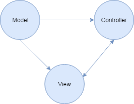
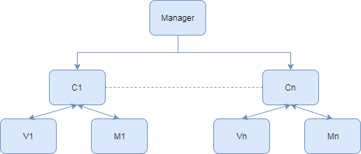
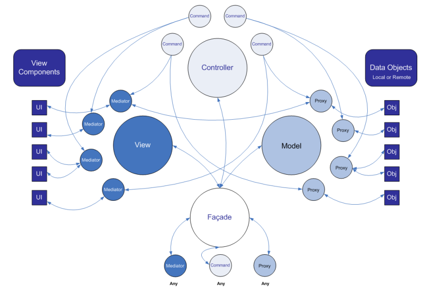
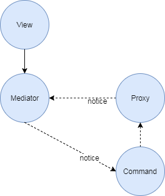
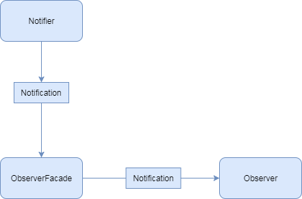
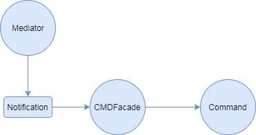

# PDMvcFramework

## MVC介绍

### MVC框架

将应用程序分为Model、View、Controller三个大模块，Model主要负责应用程序的数据持有，View模块负责业务UI展示，Controller模块负责业务逻辑处理。

---

### MVC框架实现

使用管理类统一管理注册Controller，Controller管理自己的View与Model，在Controller与Controller之间实现事件机制为模块与模块之间通信做桥梁，模块内部Controller可以控制Model与View的逻辑，View响应Controller操作并显示UI，Model由Controller控制，存储数据。

---

### PureMvc框架

---

### PureMvc

宏观上将应用程序分为Model、Controller以及View三大模块，在模块内以代理的方式将各个模块细分，并以Facade（单例）作为各个细分模块（Mediator、Proxy以及Command）的管理:

* Model以Proxy作为各个模块数据存储；
* Meditor代理View组件的行为，发生行为之后发送Notification；
* Command作为Mediator行为的执行者，将Mediator发送的Notification映射为一个个可执行的Command；

---

### PureMvc通信

* 用户操作View，调用Mediator函数
* Mediator将用户操作以及数据封装，并发送Notification
* Facade将发送的Notification派发到对应处理的Command
* Command处理完操作，存储数据（如果有的话），然后发送Notification通知Mediator
* Mediator收到Notification之后显示View

### 模块以及细分

#### View与Mediator

Mediator将View细分模块之后，各个View模块的“UI行为”操作由Mediator代理完成，Mediator是View行为与Controller（大模块）的中介，有View统一管理。

#### Model与Proxy

Proxy将Model层细分为一个个代理（Proxy），将程序的数据分组，并由Model统一管理。

#### Controller与Command

Controller统一管理各个Command操作，并且在收到Notification的时候将对应的Notification映射到Command并执行。

#### Facade与MVC

MVC将三层注册为一个个的单例之后由Facade统一管理MVC三层，Facade作为MVC三层的“门面”，为MVC的子模块提供功能。

---

### 观察者模式

#### Notification

Notification为观察者模式提供数据行为支持，是观察者模式传递数据的中介,接口如下:

|函数|参数|返回值|说明|
|---|---|---|---|
|getNotificationName|void|QString|获取该notification的标识（名字）|
|getBody|void|Qvaraient|返回该notification携带的数据|

#### Observer

Observer作为notification的监听者，是notification行为的执行人，Observer将会被注册到ObserverFacade（HashMap），ObserverFacade在收到Notification的时候从表中取出需要执行的Observer让其执行：

|函数|参数|返回值|说明|
|---|---|---|---|
|handleNotification|INotification|void|notification调用函数|

#### Notifier

Notification 消息发送者,消息发送者在调用Notification之后，将消息映射到Observer表之后，找出对应的执行者执行Notification：

|函数|参数|返回值|说明|
|---|---|---|---|
|sendNotification|Notification|void|notification发送函数|

### Command模式

Command模式映射一个个Notification为具体的执行操作，将Mediator发出的Notification转换为实际的业务逻辑：

